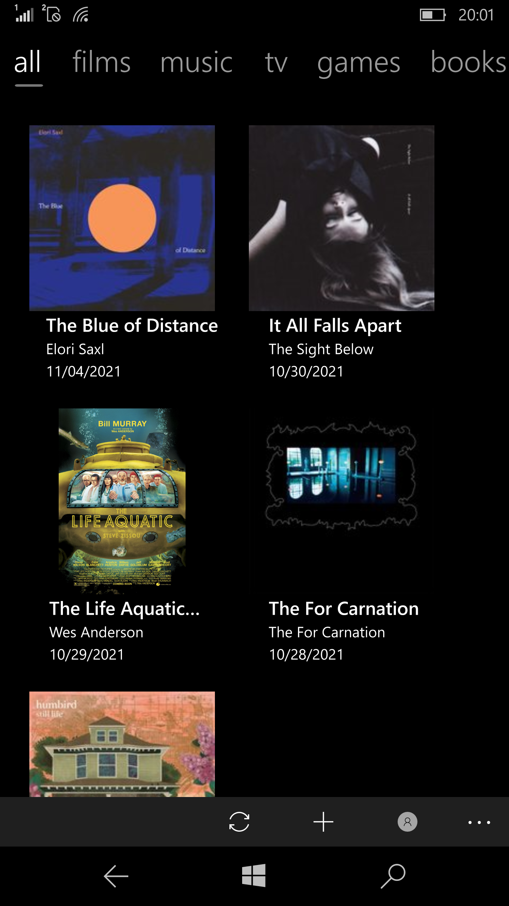
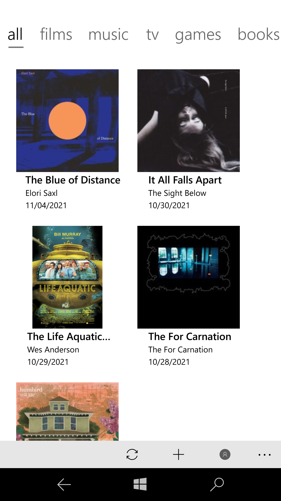
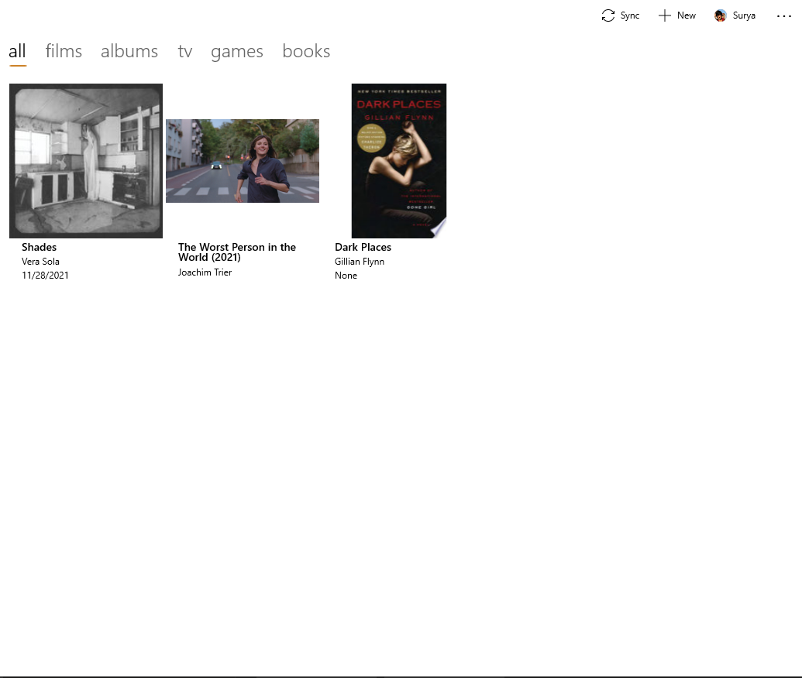
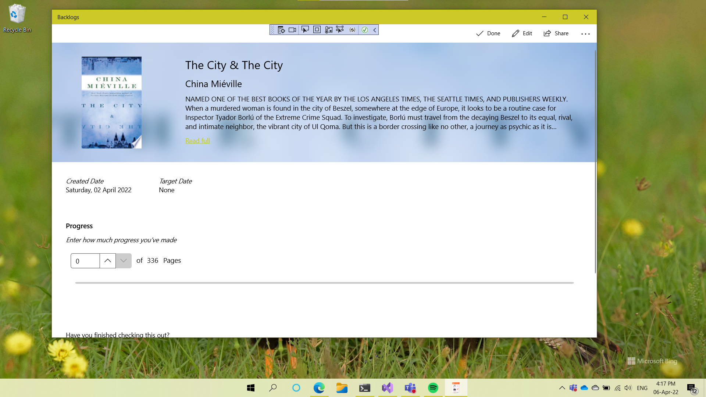

<h2>Backlogs</h2>

Backlogs is a native Windows application that lets you manage your film, TV, music, game and book backlogs all in one place. The app supports cross-device syncing across devices signed in with your Microsoft account.

The application is available to download for Windows 10, Windows 10 Mobile, Windows 11, Xbox One and Xbox Series X.

The app is currently in preview. <a href="https://forms.office.com/Pages/ResponsePage.aspx?id=DQSIkWdsW0yxEjajBLZtrQAAAAAAAAAAAAN__iSaqoNUOUlNSU9CUlk4T0pKU1hTSjZWODZXRjdHMi4u">Sign up here to download</a>

## Description
This app is built using the Universal Windows Platform framework using C# and XAML. The controls use WinUI 2. The app implements the MVVM design pattern. The backlogs created are stored in JSON format in a txt file locally and on the user's OneDrive. A Singleton is used for managing the collection of backlogs and reading/writing to the save file. OneDrive storage is implemented using Microsoft Graph.

## Screenshots
<table><tr>
<td>  </td>
<td>  </td>
<td>  </td>
<td>  </td>
</tr></table>

## Building
The app requires Visual Studio 2017 and above to be built. You will need the Universal Windows Platform compnent installed. With all of that installed, just clone the repo and run the .sln file. 
The project will fail to compile because of a missing Keys.cs file. This file contains all the API keys, and is not checked in. Contact me if you would like access to the file, or create your own file if you have your own API keys. The file should be named Keys.cs and places in the Utils folder and namespace. 

## Contributing and more
PRs are welcome! Make sure you create a new branch when making changes and pushing them. 
Please report any bugs in the Issues section. Include your OS, app version, a detailed description and steps to reproduce in the bug report.

## License 
This project is licensed under the GNU General Public License 3. Check LICENSE for more information.
